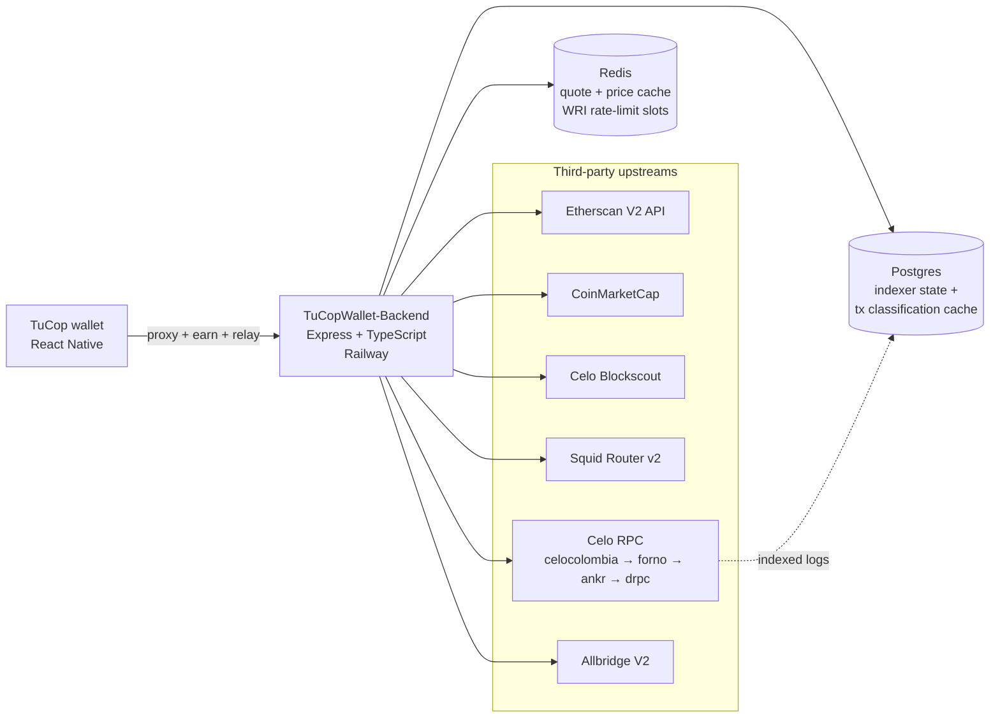

# TuCOPWallet Backend

[](https://github.com/TuCopFinance/TuCOPWallet-Backend/actions/workflows/ci.yml)
[](https://github.com/TuCopFinance/TuCOPWallet-Backend/actions/workflows/deploy-railway.yml)
[](LICENSE)
[](https://nodejs.org/)
[](https://www.typescriptlang.org/)

Backend services for [TuCopWallet](https://tucop.xyz). Proxies third-party APIs (Etherscan, CoinMarketCap, Blockscout, Squid) so API keys never ship in app bundles, runs two on-chain indexers (transactions feed + Neeru partner integration), serves the wallet's Earn surface via a `hooks-api` compatible HTTP contract, and operates a one-time EIP-7702 sponsored delegation relay so users without CELO can opt into the WRI (Wallet Relay Infrastructure) batch-execution path.

## About TuCop

TuCop is a mobile wallet for Colombian users built on the [Celo](https://celo.org) L1. The wallet is stablecoin-first (COPm, USDm, USDT, USDC) and never asks users to hold CELO for gas. This backend is the server-side counterpart that the mobile app (React Native) calls; it replaces several Valora cloud functions the wallet used to depend on, plus adds TuCop-specific pieces (Neeru Earn, WRI delegate relay, COPm/Dolares conversion paths).

- Wallet repository: [TuCopFinance/TuCopWallet](https://github.com/TuCopFinance/TuCopWallet)
- Hosted backend: `https://tucop-backend-production.up.railway.app`
- Project home: [tucop.xyz](https://tucop.xyz)

## Architecture



Two worker loops boot inside the same process:

- **Transactions indexer** (`src/transactions-indexer/`) ingests Celo blocks for opted-in addresses, classifies txs into the wallet's `TokenTransaction` shape, and persists to Postgres. Includes the EIP-7702 atomic-batch extension that Valora's feed omits.
- **Neeru indexer** (`src/neeru-indexer/`) watches four event topics on the partner contract, persists per-position state, and runs a daily reconciliation job at 03:00 UTC.

Both workers use Postgres advisory locks for multi-replica safety and back off on consecutive errors with escalating log levels for operator monitoring.

## Cross-cutting behaviour

- **Rate limit:** 300 requests per IP per 60 s window across all endpoints (`express-rate-limit`, in-memory). Sized so an active user firing ~10 swaps in 2-3 minutes (quote refreshes + receipt polling + feed/balance refresh) does not hit the wall; sustained 5 req/s is still considered bot traffic. Exceeding it returns `429 { "error": "rate limit exceeded" }`. Trust-proxy is set to one hop so Railway's LB forwards the real client IP. Per-endpoint tiering is tracked in `ROADMAP.md`.
- **Upstream timeout:** every outbound call (Etherscan, CoinMarketCap, Blockscout) is wrapped in `fetchWithTimeout` with an 8 s default, so a hung upstream never holds an inbound request open indefinitely.
- **Cache fallthrough:** when `REDIS_URL` is unset or set to the literal `disabled`, every request goes direct to upstream. Otherwise the cache is consulted with normalised keys; failed cache reads or writes fall through and never break the response.
- **Logging:** all diagnostic output goes through `src/lib/logger.ts` with per-module namespaces (e.g. `[app:req]`, `[routes:blockscout]`). In production (`NODE_ENV=production`) only `warn` and `error` are emitted.

## Endpoints

### `GET /health`

Liveness probe. Returns 200 with static service info as long as the process is responsive. Does NOT check dependencies; use `/ready` for that.

```json
{ "ok": true, "service": "tucopwallet-backend", "version": "0.1.0" }
```

### `GET /ready`

Readiness probe. Checks Postgres, Redis, and Celo RPC each with a 1s timeout. Returns 200 when all healthy or when the optional deps (DB, Redis) are unconfigured; returns 503 with a per-dependency status when any required check fails.

```json
{ "ok": true, "checks": { "db": "ok", "redis": "ok", "rpc": "ok" } }
```

```json
{ "ok": false, "checks": { "db": "fail: connection refused", "redis": "ok", "rpc": "ok" } }
```

Operator alerts should page on `/ready` 503s, not `/health`.

### `GET /health/relay`

Relay hot-wallet health surface. Returns the relay address and current CELO balance (private key never exposed). Lets external monitors alert on low balance without an Sentry / Grafana integration.

```json
{
  "ok": true,
  "address": "0x...",
  "balanceWei": "10000000000000000000",
  "balanceCelo": "10"
}
```

Returns `503 { "ok": false, "error": "relay not configured" }` when `WRI_RELAY_PK` is missing or invalid, or `502 { "ok": false, "error": "rpc unavailable", "address": "0x..." }` on RPC failure.

### `GET /metrics`

Prometheus scrape endpoint (text format). Includes default Node/process metrics, an `http_request_duration_seconds` histogram labeled by method/route/status, custom `wri_relay_*` counters/gauges, `pg_pool_*` gauges, and Neeru indexer gauges. Scrape interval recommendation: 30s.

### `GET /api/prices/xaut`

Proxies a XAUt0 price quote (in USD) from CoinMarketCap. Cached in Redis for 60 seconds when `REDIS_URL` is configured; serves direct otherwise.

**Query params:**

| Name | Required | Description |
|------|----------|-------------|
| `vs` | no | Quote currency. Only `usd` is supported. Defaults to `usd`. |

**Success response:**

```json
{ "symbol": "XAUT", "vs": "usd", "priceUsd": 3421.5, "asOf": "2026-06-16T12:00:00.000Z" }
```

**Error responses:**

- `400` `{ "error": "only vs=usd supported" }`
- `502` `{ "error": "upstream price feed unavailable" }`

### `GET /events`

Proxies a contract event-log query to Etherscan V2 API on Celo mainnet (chainid 42220). Only whitelisted contract addresses are accepted (see `ALLOWED_CONTRACTS` in `src/app.ts`).

**Query params:**

| Name | Required | Description |
|------|----------|-------------|
| `address` | yes | Contract address (`0x` + 40 hex). Must be in `ALLOWED_CONTRACTS`. |
| `topic0` | no | Event signature topic. `0x` + 64 hex. |
| `topic1` | no | First indexed argument. `0x` + 64 hex. |
| `fromBlock` | no | Default `0`. |
| `toBlock` | no | Default `latest`. |

**Success response:**

```json
{ "events": [ { "address": "...", "topics": [...], "data": "0x...", ... } ] }
```

**Error responses:**

- `400` `{ "error": "invalid address" }` / `invalid topic0` / `invalid topic1`
- `403` `{ "error": "contract not allowed" }`
- `502` `{ "error": "etherscan error" }` / `etherscan unreachable` (upstream message is logged server-side, never returned)
- `503` `{ "error": "etherscan key not configured" }`

### Blockscout proxy

Passthrough proxy for Celo's Blockscout V2 API, injecting the API key on the server side so the mobile app never sees it. Responses are returned exactly as Blockscout returns them.

| Endpoint | Cache TTL |
|----------|-----------|
| `GET /api/v2/transactions/:hash` | 30 s |
| `GET /api/v2/addresses/:address/transactions` | 30 s |
| `GET /api/v2/addresses/:address/token-transfers` | 300 s |

**Query params** are strictly whitelisted per route. Unknown keys (including the reserved `apikey` / `api_key`) return `400 { "error": "unknown param" }`. Cache keys are normalised (sorted, reserved params dropped, capped at 512 chars) so callers cannot blow up the Redis keyspace.

| Route | Allowed query params |
|---|---|
| `GET /api/v2/transactions/:hash` | (none) |
| `GET /api/v2/addresses/:address/transactions` | `filter`, `block_number`, `index`, `items_count` |
| `GET /api/v2/addresses/:address/token-transfers` | `filter`, `type`, `token`, `block_number`, `index`, `items_count` |

Adding a new param means a deliberate edit to `ALLOWED_*_PARAMS` in `src/routes/blockscout.ts`, not silent passthrough.

**Host allowlist:** `BLOCKSCOUT_BASE_URL` must use https:// AND its hostname must appear in the static allowlist in `src/server.ts` (default: `celo.blockscout.com`). Operators can add hosts via the comma-separated `BLOCKSCOUT_ALLOWED_HOSTS` env. A misconfigured deploy now fails at boot with a clear error rather than turning the proxy into a generic SSRF gateway.

**Validation:** `:hash` must match `0x` + 64 hex; `:address` must match `0x` + 40 hex. Otherwise `400 { "error": "invalid ..." }`. Upstream failures return `502 { "error": "blockscout upstream unavailable" }`.

### `GET /api/swap/quote`

Drop-in replacement for Valora's `getSwapQuote` cloud function. Backend POSTs to Squid Router v2 with TuCop's `x-integrator-id` so swap volume attribution flows to TuCop. The response shape matches the wallet's `FetchQuoteResponse` (`src/swap/types.ts` in TuCopWallet) so the mobile-side change is a single URL flip.

**Query params (strict allowlist; any other key returns `400 { "error": "unknown param" }`):**

| Name | Required | Validation | Notes |
|------|----------|------------|-------|
| `buyToken` | yes | `0x` + 40 lowercase hex | destination token |
| `buyIsNative` | yes | `'true'` or `'false'` | substitutes the EVM native sentinel upstream |
| `buyNetworkId` | yes | matches `/^[a-z0-9-]+$/` | e.g. `celo-mainnet`, `ethereum-mainnet`, `arbitrum-one`, `op-mainnet`, `polygon-pos-mainnet`, `base-mainnet` |
| `sellToken` | yes | `0x` + 40 lowercase hex | source token |
| `sellIsNative` | yes | `'true'` or `'false'` | |
| `sellNetworkId` | yes | same set as `buyNetworkId` | |
| `sellAmount` | yes | decimal integer (smallest unit / wei) | |
| `userAddress` | yes | `0x` + 40 lowercase hex | EOA used for `fromAddress` and `toAddress` upstream |
| `slippagePercentage` | no | decimal in `[0, 100]` | defaults to `0.5` |
| `quoteOnly` | no | `'true'` or `'false'` | defaults to `'false'`. Set to `'true'` for planning quotes (multi-step `dollarsSpend` flows that fan out 3-5 parallel quotes for the same user); Squid skips the `transactionRequest` build, and per their team this path does NOT charge the wallet-based 10 RPS bucket. Refetch with `quoteOnly=false` (or omit it) on commit, once the user picks a route — that single call IS the one that counts against the bucket. |

**Success response (shape):**

```json
{
  "unvalidatedSwapTransaction": {
    "swapType": "same-chain",
    "chainId": 42220,
    "buyAmount": "998000",
    "sellAmount": "1000000",
    "buyTokenAddress": "0x...",
    "sellTokenAddress": "0x...",
    "price": "0.998",
    "guaranteedPrice": "0.993",
    "estimatedPriceImpact": "0.2",
    "gas": "300000",
    "estimatedGasUse": "200000",
    "to": "0x...",
    "value": "0",
    "data": "0x...",
    "from": "0x...",
    "allowanceTarget": "0x..."
  },
  "details": { "swapProvider": "squid" }
}
```

When `sellNetworkId !== buyNetworkId`, the `unvalidatedSwapTransaction` object additionally has `swapType: "cross-chain"` plus `estimatedDuration` (seconds), `maxCrossChainFee` and `estimatedCrossChainFee` (wei strings, sum of upstream `feeCosts`).

**Error responses:**

- `400` `{ "error": "invalid <field>" }` / `{ "error": "unknown param" }` / `{ "error": "unsupported sellNetworkId" }` / `{ "error": "unsupported buyNetworkId" }`
- `429` `{ "error": "rate limited by squid, retry" }` (pass-through when Squid throttles us; the upstream `Retry-After` header is forwarded). Squid throttles per-wallet at 10 RPS, so the safe pattern for parallel planning quotes is `quoteOnly=true` on the planner and `quoteOnly=false` only on commit.
- `502` `{ "error": "squid upstream unavailable" }` (timeout or non-429 non-2xx from Squid; the upstream message is never echoed)
- `503` `{ "error": "squid integrator id not configured" }` if `SQUID_INTEGRATOR_ID` is not set on the backend

Cached in Redis for 30 s (quotes go stale fast). Cache key includes `userAddress` so we never serve another user's prepared transaction.

### `POST /api/wri/delegate-relay`

One-time, sponsored EIP-7702 delegation setup for TuCop's Wallet Relay Infrastructure (WRI). Most TuCop users hold only stables (USDT, USDC, USDm) and no CELO; this endpoint pays the gas for the single type 0x04 transaction that delegates a user's EOA to TuCop's hardened BatchExecutor at `0xaE6a87E88b55644Eda54C3AA55B11944eE5E1DFe`. After delegation, every Dolares to Pesos conversion is a normal CIP-64 (type 0x7b) transaction paying gas in stables; CIP-64 and 0x04 are mutually exclusive at the Celo protocol level, hence this dedicated setup tx.

**Request body** (`application/json`):

```json
{
  "userAddress": "0x...",
  "signedAuthorization": {
    "chainId": "0xa4ec",
    "address": "0xaE6a87E88b55644Eda54C3AA55B11944eE5E1DFe",
    "nonce": "0x...",
    "yParity": "0x0",
    "r": "0x...",
    "s": "0x..."
  }
}
```

`signedAuthorization` is the JSON shape viem's `walletClient.signAuthorization(...)` emits.

**Security invariants (any failure -> 400, no tx submitted):**

- `userAddress` must match `0x` + 40 hex.
- `signedAuthorization.chainId` must be `42220` (Celo mainnet only).
- `signedAuthorization.address` must equal `0xaE6a87E88b55644Eda54C3AA55B11944eE5E1DFe` (case-insensitive). The relay refuses to delegate to any other contract, period. Hardcoded.
- `signedAuthorization.nonce` must equal the on-chain nonce of `userAddress` exactly. A stale or future nonce is rejected up front; the `already_delegated` short-circuit + post-mining `getCode` poll handle the propagation-lag case.
- The signature must recover to `userAddress` via `recoverAuthorizationAddress`.

**Operational invariants:**

- If the user's EOA code already starts with `0xef0100` followed by the BatchExecutor address, the endpoint short-circuits with `{ "status": "already_delegated" }` and submits no tx.
- **Three-tier rate limiting** (each independent; all must pass):
  - **Per-IP:** `WRI_RELAY_PER_IP_LIMIT` requests per minute per source IP (default `20`). Blocks address-spraying from a single source. Set to `0` to disable.
  - **Global token bucket:** `WRI_RELAY_GLOBAL_LIMIT` requests per minute total across ALL addresses + IPs (default `60`). Defense against distributed spraying. Requires Redis; fail-closed (returns 503 `rate limiter unavailable`) when Redis is down. Set to `0` to disable.
  - **Per-address:** 1 successful relay per 5 minutes per `userAddress` (Redis-backed when `REDIS_URL` is configured; bounded in-process Map otherwise, capped at 10k entries with the same 5 minute TTL).
- The global 300 req/min/IP ceiling from `app.ts` still applies on top of these.
- Relay hot-wallet health check: if balance is below `WRI_RELAY_MIN_CELO_BALANCE`, returns 503 and logs an alert.

**Success response (delegation submitted and confirmed):**

```json
{
  "status": "delegated",
  "txHash": "0x...",
  "userAddress": "0x...",
  "delegatedTo": "0xaE6a87E88b55644Eda54C3AA55B11944eE5E1DFe"
}
```

**Error responses:**

- `400` `{ "error": "invalid userAddress" }` / `invalid signedAuthorization` / `invalid chainId` / `invalid delegation target` / `invalid signature` / `nonce mismatch`
- `429` `{ "error": "ip rate limited" }` (per-IP tier) / `relay globally rate limited` (global token bucket) / `address rate limited` (per-address tier) - each with `Retry-After` header
- `502` `{ "error": "rpc unavailable" }` / `relay tx submission failed` / `relay tx reverted` / `relay tx unconfirmed` / `relay tx unverified`
- `503` `{ "error": "relay temporarily unavailable" }` (relay private key missing/invalid or balance below threshold) / `rate limiter unavailable` (global tier requires Redis and Redis is down)

**Out of scope:** this endpoint ONLY handles the one-time delegation setup. The actual `execute(calls)` payload that uses the delegated EOA must be sent by the wallet as a regular CIP-64 transaction; the backend does not relay batch payloads.

### `POST /api/wri/fee-adapter-bootstrap`

One-shot, sponsored `approve(adapter, MAX_UINT256)` on each adapter-only stable the user holds. Solves the WRI Track C chicken-and-egg case: a user whose only dollar balance is in `USDC` or `USDT` (both adapter-only fee currencies on Celo) cannot pay gas on any tx because the adapter contract needs allowance, allowance setting needs an `approve()` tx, and `approve()` needs gas. Without a sponsored bootstrap such a user is stuck. The wallet UI groups `USDC + USDT + USDm` as "Dolares" so users do not see the distinction; reactively calling this endpoint on first action unblocks them transparently.

**Precondition:** the user EOA must already be delegated to TuCop's BatchExecutor (via `/api/wri/delegate-relay`). The endpoint sends a tx to the user EOA calling `BatchExecutor.execute([(token, 0, approve(adapter, MAX_UINT256))])`, so `msg.sender` inside `approve()` is the user EOA, not the relay. The relay only pays gas. Calls without a prior delegation return `412`.

**Request body** (`application/json`):

```json
{ "address": "0x..." }
```

**Required env:**

- `WRI_FEE_BOOTSTRAP_ENABLED=true` (kill switch; default `false` returns `503`).
- `WRI_RELAY_PK` (same hot wallet as `/api/wri/delegate-relay`).
- `WRI_FEE_ADAPTER_USDC` and/or `WRI_FEE_ADAPTER_USDT`: the adapter contract address for each adapter-only token. Tokens whose env var is unset are silently skipped (`status: "skipped_no_adapter"`).

**Idempotency:** for each token, if `allowance(user, adapter) >= 2**200` the endpoint short-circuits with `status: "already_approved"` and submits no tx. Re-calling after a successful bootstrap is therefore a free read-path no-op.

**Success response (`200`):**

```json
{
  "ok": true,
  "relayAddress": "0x...",
  "results": [
    {
      "tokenSymbol": "USDC",
      "tokenAddress": "0xceba9300f2b948710d2653dd7b07f33a8b32118c",
      "adapterAddress": "0x...",
      "status": "approved",
      "txHash": "0x...",
      "alreadyApproved": false
    },
    {
      "tokenSymbol": "USDT",
      "tokenAddress": "0x48065fbBE25f71C9282ddf5e1cD6D6A887483D5e",
      "adapterAddress": "0x...",
      "status": "skipped_no_balance",
      "txHash": null,
      "alreadyApproved": false
    }
  ]
}
```

Per-token `status` values: `approved`, `already_approved`, `skipped_no_balance`, `skipped_no_adapter`, `relay_failed`. The endpoint never partial-fails the whole response - a tx failure on one token is reported in that token's row and other tokens still get processed.

**Error responses:**

- `400` `{ "error": "invalid address" }`
- `412` `{ "error": "precondition failed: user not delegated to BatchExecutor" }`
- `500` `{ "error": "internal" }`
- `503` `{ "error": "fee bootstrap disabled" }` (kill switch) / `relay temporarily unavailable` (relay PK missing) / `no adapter tokens configured` (none of the `WRI_FEE_ADAPTER_*` vars are set)

**Out of scope:** this endpoint reuses the global 300 req/min/IP ceiling from `app.ts`. A dedicated three-tier limit matching `/api/wri/delegate-relay` is tracked as a follow-up.

### Transaction feed (WRI Track C)

Backend-owned replacement for Valora's `getWalletTransactions`. Indexes Celo blocks for opted-in addresses and classifies into the same `TokenTransaction` shape the wallet already consumes, with an extension for EIP-7702 atomic batches (which Valora omits).

**Required env to enable on Railway:** `DATABASE_URL` (Postgres; migrations run on boot) and `INDEXER_ENABLED=true`. Without these the routes return `503` and the indexer loop is a no-op.

**Historical backfill (`POST /watch` triggers, resumable across restarts):**

- `TX_INDEXER_BACKFILL_BLOCKS` (default `10000`, tunable up to millions of blocks). Depth of the historical scan window measured from the current tip at first-watch time.
- `TX_INDEXER_BACKFILL_CHUNK_DELAY_MS` (default `150`). Baseline sleep between eth_getLogs chunks. Doubles up to `TX_INDEXER_BACKFILL_MAX_DELAY_MS` (default `5000`) on RPC failure and decays back down on success.
- `TX_INDEXER_BACKFILL_ENABLED` (default `true`). Kill switch for the backfill loop specifically; `/watch` still registers addresses when disabled but no historical scan runs.

The backfill uses the same primary -> forno -> ankr -> drpc fallback chain the Neeru indexer ships (see `src/lib/celoRpcFallback.ts`); a circuit breaker per endpoint (3 fails -> skip 5 min) transparently rotates around Cloudflare 1015 / 429s / timeouts. Progress is checkpointed per chunk (`watched_address.backfill_cursor_block` advances inside the same transaction that persists the chunk's tx rows), so a Railway redeploy mid-scan resumes exactly where it left off. The boot path calls `resumePendingBackfills(db)` to auto-restart every `backfill_completed_at IS NULL AND backfill_cursor_block IS NOT NULL` row.

Grafana metrics for the backfill loop:

```text
transactions_indexer_backfill_chunks_total{outcome="ok|persist_error|rpc_error"}
transactions_indexer_backfill_active_jobs
transactions_indexer_backfill_blocks_remaining
```

**Kill switches (evaluated per-request; flip takes effect on next request without a restart):**

- `TX_FEED_ENABLED` (default `true`). Set to the literal string `false` to gate `/api/transactions/feed` to a `503 { "error": "feed disabled" }` response.
- `TX_WATCH_ENABLED` (default `true`). Same for `/api/transactions/watch` -> `503 { "error": "watch disabled" }`.

The forward worker is NOT disabled by these switches; it keeps advancing `indexer_state` so a re-flip lands on a fresh cursor. To pause the worker itself, unset `INDEXER_ENABLED` (requires a Railway restart).

**Response shape (`TokenTransaction`) - important post-2026-07-06:**

- `TokenAmount.value` is a **decimalised human-readable string** (e.g. `"3500.000000000000000000"`), NOT raw wei. The wallet consumes it via `new BigNumber(value)` without dividing by `10^decimals`.
- `TokenAmount.decimals` is the number of decimals used to scale `value`. `null` when the token is outside the canonical CIP-64 / Mento registry - in that case `value` is the raw wei fallback so no precision is silently lost.
- `TokenAmount.timestamp` mirrors the parent tx's top-level timestamp (ms). Populated for every amount to match Valora's shape.
- `TokenAmount.localAmount` is always populated - either the peg-matched conversion or explicit `null` when the token has no peg or the requested `localCurrencyCode` does not match the peg.
- `TokenTransaction.status` is `"Complete"` for successful txs and `"Failed"` for reverted txs. Reverted txs surface with `status: "Failed"` so the wallet timeline can show attempted actions.
- **Swap classifier: "swap intent" (Valora-compatible) convention.** `inAmount` / `outAmount` / `fromTokenAmounts[]` include only the swap-leg movements (user -> counterparty and counterparty -> user in DIFFERENT tokens). Fee sink outbounds, mirror mint+burn refunds, and aggregator fees are excluded from these fields and appear only in `fees[]`. Aligns byte-exact with the numbers users have seen in Valora historically. See `filterToSwapLegs` in `src/transactions-indexer/classifier.ts` for the exact rule.
- **`fees[].amount` respects `tx.feeCurrency` (CIP-64).** For Mento native fee currencies (USDm / COPm / EURm / BRLm) the fee row is emitted with the token address directly. For adapter-only fee currencies (USDC / USDT via their Mento adapter contracts) the fee row is surfaced as the underlying token with underlying decimals (6 for USDC / USDT), downshifted from the adapter's 18-decimal-normalised units so `BigNumber(value)` yields the user-visible amount. Native-CELO-fee txs fall back to the CELO ERC20 contract id with 18 decimals.

#### `POST /api/transactions/watch`

Registers an address for indexing and triggers a one-shot historical backfill in the background. Called by the wallet at boot after `walletAddressInitialized`. Idempotent, safe to retry, the wallet should not block on its result.

```json
{ "address": "0x...", "walletCreatedAt": "2026-01-15T10:30:00.000Z" }
```

`walletCreatedAt` is optional; when the wallet supplies it, the backfill window's `fromBlock` is extended to cover activity going back to that timestamp instead of the default `TX_INDEXER_BACKFILL_BLOCKS` tail. Rules:

- ISO 8601 timestamp (UTC). Any Date.parse-compatible string works but `.toISOString()` is the recommended shape.
- Rejected if in the future, unparseable, or earlier than `2020-04-01T00:00:00Z` (Celo mainnet floor).
- Never truncates the default window - it only extends it further into the past if the derived `fromBlock` is older than the default.
- Hard cap: never scans more than 5 000 000 blocks even if the timestamp implies deeper. This protects the RPC budget for other watched wallets from an accidentally-huge backfill.
- The formula segments across the Celo L2 migration (block 31 056 500 at `2025-03-26T00:00:00Z`): ~1 s/block post-L2, ~5 s/block pre-L2.

When `walletCreatedAt` is omitted, the backfill uses the existing `TX_INDEXER_BACKFILL_BLOCKS` default (10 000 blocks ~ 2.8 hours on Celo L2). Passing it is safe on repeat `/watch` calls: the window is only initialised once per address and subsequent `/watch` requests do not re-trigger backfill if it is already complete.

Response `200`:

```json
{
  "ok": true,
  "backfillStartedAt": "2026-06-29T20:00:00.000Z",
  "backfillCompleted": false
}
```

`backfillStartedAt` is the timestamp of the first INSERT for this address (set once, preserved across re-watch calls). `backfillCompleted` flips to `true` after the background job finishes writing historical rows. The HTTP response is sent immediately - the wallet should not await `backfillCompleted` becoming `true`, just poll `/feed` and rows will appear as the backfill makes progress.

The backfill scans the derived block window for ERC20 Transfer events touching the address as `from` or `to`, fetches tx + receipt + block timestamp via JSON-RPC, and writes through the same persistence layer the live worker uses. Native CELO sends are not discovered by this method (acceptable for an MVP since real users pay gas in stables); the live worker still catches them going forward.

Errors: `400 invalid address`, `400 invalid walletCreatedAt`, `503 database not configured`, `500 database error`.

#### `GET /api/transactions/indexer/health`

Operator probe for the indexer worker. Reports the last indexed block, current Celo tip, lag (tip minus last), and how many addresses are being watched.

```json
{
  "networkId": "celo-mainnet",
  "lastIndexedBlock": 70513283,
  "celoTipBlock": 70513290,
  "lagBlocks": 7,
  "watchedAddressCount": 42
}
```

`celoTipBlock` and `lagBlocks` are `null` when the RPC tip probe fails (1.5 s timeout) so the route stays responsive during Forno blips. `lastIndexedBlock` is `null` before the worker has written its first cursor. The same numbers are exported as Prometheus gauges `transactions_indexer_lag_blocks` and `transactions_indexer_watched_addresses` (labelled by `network_id`) for Grafana alerts; the worker also refreshes them on every tick so `/metrics` stays current when no one is calling the health route.

Errors: `503 database not configured`, `500 internal` (when the indexer_state query itself fails).

#### `GET /api/transactions/feed`

Byte-compatible replacement for Valora. Same response envelope (`{ transactions, pageInfo: { hasNextPage, endCursor } }`) and same `TokenTransaction` discriminated union (`SENT` / `RECEIVED` / `SWAP_TRANSACTION` / `APPROVAL` / `DEPOSIT` / `WITHDRAW` / `CLAIM_REWARD`).

**Query params:**

| Name | Required | Notes |
|------|----------|-------|
| `address` | yes | `0x` + 40 hex (case-insensitive) |
| `networkIds` | no | csv, defaults to `celo-mainnet` |
| `includeTypes` | no | csv of `TokenTransaction` types, filter applied post-classification |
| `localCurrencyCode` | no | ISO 4217 alpha-3 (e.g. `USD`, `COP`). Default `USD`. Populates `localAmount` on each `TokenAmount` whose token has a hard fiat peg matching this code (Mento stables + USDC/USDT). Unknown / volatile tokens (CELO) are left without `localAmount` and the wallet keeps its own renderer |
| `afterCursor` | no | opaque cursor returned by a previous page |
| `pageSize` | no | 1 to 100, default 20 |

**7702 atomic-batch extension:** when one tx atomically sells more than one token, the wallet receives a single `SwapTransaction` whose `fromTokenAmounts[]` lists every sold token; `outAmount` is the highest-value leg so existing single-leg renderers keep working unchanged. `inAmount` is the bought token. The selector keyed off is `0x3f707e6b` (`execute((address,uint256,bytes)[])` on the BatchExecutor at `0xaE6a87E88b55644Eda54C3AA55B11944eE5E1DFe`).

**Token IDs:** ERC20s are emitted as `celo-mainnet:0x<contract>`. CELO native is emitted as its ERC20 contract id `celo-mainnet:0x471ece3750da237f93b8e339c536989b8978a438`, not a `:native` sentinel, so the wallet's token registry resolves it the same way as any other ERC20.

**Earn extension (`DEPOSIT` / `WITHDRAW` / `CLAIM_REWARD`):** when a tx emits an event from a configured Earn contract (currently Neeru Vaults, via `NEERU_CONTRACT_ADDRESS` + `NEERU_EVENT_A/B/C_TOPIC0`), the classifier emits an `EarnTransaction` instead of folding the deposit token movement into a bogus swap. `EarnTransaction` extends the base shape with `appId` (`"neeru-vaults"` today; other protocols pluggable via the env registry), `positionId` (string or `null`, decoded from the event's indexed `positionId` topic), and `amount` (`TokenAmount` for the ERC20 leg between the user and the earn contract). Kind A = new position -> `DEPOSIT`; Kind B = early withdrawal -> `WITHDRAW`; Kind C = matured claim -> `CLAIM_REWARD`. The Earn rule runs BEFORE the swap rules so a Neeru deposit tx (which moves COPm user -> contract) is never misclassified as a swap.

Errors: `400 invalid address` / `invalid afterCursor`, `503 database not configured`, `500 database error`.

#### Neeru indexer

Postgres-backed indexer for a partner integration on Celo. Stores per-position state used by the Earn endpoints (forthcoming PRs).

**Env to enable on Railway:**

- `NEERU_INDEXER_ENABLED=true` to start the worker. No-op without it.
- `NEERU_INDEXER_INTERVAL_MS` optional, defaults to `30000`.
- Reuses `DATABASE_URL`.

Tables created by the migration: `neeru_positions`, `neeru_indexer_state`.

RPC fallback chain (`src/neeru-indexer/rpc.ts`): tries `https://rpc.celocolombia.org` (primary) first, then `https://forno.celo.org`, then `https://rpc.ankr.com/celo`, then `https://celo.drpc.org`. After 3 consecutive primary failures the indexer skips the primary for 5 minutes before retrying.

Runs a daily reconciliation job at 03:00 UTC.

### Hooks API

Drop-in replacement for Valora's `hooks-api`. Surfaces the catalogue of Earn products the wallet renders in the Earn tab. Two apps are wired today: the Allbridge native port (LP positions + reward claims) and the Neeru Vaults partner integration (4 categories keyed off the indexer above). The contract address and per-category metadata are read from env + on-chain at request time; no Neeru-specific constants are baked into source.

Each endpoint returns `{ "data": [...] }` with a discriminated union of `app-token` / `contract-position` entries. Tranche metadata (TVL, daily rate, lock seconds, deposit-token decimals/symbol) is fetched via one Multicall3 call and cached in-process for 30 s; per-user balances are read from `neeru_positions` (Postgres) plus a per-batch Multicall3 for `previewAccruedInterest`. Allbridge calls are wrapped in try/catch and never fail the whole response - if upstream times out the wallet still sees the Neeru side.

#### `GET /hooks-api/getPositions`

Returns positions the user already holds (Allbridge LPs with non-zero balance + Neeru categories with non-zero amount-plus-accrued).

| Param | Required | Notes |
|------|----------|-------|
| `address` | yes | `0x` + 40 hex (case-insensitive) |
| `networkIds` | no | repeatable; defaults to `celo-mainnet` |

Returns `{ "data": Position[] }`. 400 on invalid `address` or unsupported `networkIds`.

#### `GET /hooks-api/getEarnPositions`

Returns the full catalogue (4 Neeru categories + Allbridge LPs) regardless of holdings. When `address` is omitted, every entry has `balance: "0"`.

| Param | Required | Notes |
|------|----------|-------|
| `address` | no | `0x` + 40 hex; when set, balances are populated |
| `networkIds` | no | repeatable; restricts to listed networks |
| `supportedAppIds` | no | repeatable; restricts to listed app ids (`allbridge`, `neeru-vaults`) |
| `supportedPools` | no | repeatable; restricts to specific `positionId` values |

#### `GET /hooks-api/v2/getShortcuts`

Returns the merged shortcut catalogue (Allbridge `deposit` / `withdraw` / `claim-rewards` / `swap-deposit`, Neeru `deposit` / `withdraw` / `withdraw-amount-only`).

| Param | Required | Notes |
|------|----------|-------|
| `address` | no | reserved; ignored for now |
| `networkIds` | no | repeatable; restricts the shortcut list |

#### `GET /api/earn/neeru/positions`

Per-position detail surface for the wallet's "your positions" screen. Returns one entry per OPEN row in `neeru_positions`, enriched with live on-chain reads from the partner contract via a single batched Multicall3 request. Read responses (per-category metadata, deposit-token decimals, and any global view fields) are cached in-process for 30 s.

| Param | Required | Notes |
|------|----------|-------|
| `address` | yes | `0x` + 40 lowercase hex |

Any other query key returns `400 { "error": "unknown param" }` (strict allowlist).

**Response shape (placeholder values):**

```json
{
  "data": {
    "address": "0x...",
    "positions": [
      {
        "positionId": "<opaque>",
        "category": 1,
        "categoryLabel": "<derived from on-chain per-category metadata>",
        "amount": "<decimal-formatted>",
        "accruedInterest": "<decimal-formatted>",
        "monthlyRatePercentage": "<numeric>",
        "startTs": 1700000000,
        "endTs": 1702592000,
        "depositBlock": "<opaque>",
        "depositTxHash": "0x...",
        "renewedFromPositionId": null,
        "currentPayoutIfClosed": {
          "amount": "<decimal-formatted>",
          "interest": "<decimal-formatted>",
          "penaltyBps": "<numeric>",
          "interestAfterPenalty": "<decimal-formatted>",
          "total": "<decimal-formatted>",
          "isEarly": true
        }
      }
    ],
    "lastSyncedBlock": "<opaque>",
    "lastSyncedAt": "<iso-8601>"
  }
}
```

Notes:

- `categoryLabelFor` is `Flexible` for the flexible-category category; otherwise a `<days> dias` label derived from the on-chain per-category metadata.
- `monthlyRatePercentage` is computed from the per-position frozen-rate field stored on chain at deposit time, not from the live per-category rate, so quotes do not drift after a per-category-rate update.
- `currentPayoutIfClosed.isEarly` is `true` only when the position is locked AND `now < endTs`. The early-claim penalty math runs in wei (bigint floor division) before the value is formatted.
- `renewedFromPositionId` is always `null`; the indexer schema does not track renewal chains.
- `lastSyncedBlock` / `lastSyncedAt` come from `neeru_indexer_state` so the wallet can warn if the partner indexer is stale.

**Error responses:**

- `400` `{ "error": "invalid address" }` if `address` is missing, not lowercase, or not 40 hex.
- `400` `{ "error": "unknown param" }` for any query key other than `address`.
- `503` `{ "error": "database not configured" }` when `DATABASE_URL` is unset.
- `503` `{ "error": "neeru not configured" }` when `NEERU_DEPOSIT_TOKEN_ADDRESS` is unset.
- `502` `{ "error": "detail fetch failed" }` on any infra/RPC failure. Underlying message is logged server-side and never echoed.

#### `POST /hooks-api/triggerShortcut`

Returns the ordered list of tx calldata the wallet signs and submits to execute one shortcut. The backend performs the preflight reads (allowance, pause flag, caps, ownership) so the wallet does not have to fan out and reason about per-shortcut invariants. No tx is submitted server-side.

**Request body** (`application/json`):

```json
{
  "address": "0x...",
  "appId": "neeru-vaults",
  "networkId": "celo-mainnet",
  "shortcutId": "deposit",
  "...": "protocol-specific args"
}
```

Common fields:

| Field | Validation |
|------|------------|
| `address` | `0x` + 40 hex (case-insensitive) |
| `appId` | exact match: `allbridge` or `neeru-vaults` |
| `networkId` | exact match: `celo-mainnet` |
| `shortcutId` | string; valid set depends on `appId` |

**Per-app body shape:**

- `appId: "allbridge"`:
  - `shortcutId: "deposit"`: `{ positionAddress, tokenAddress, tokenDecimals, tokens: [{ amount }] }`
  - `shortcutId: "withdraw"`: `{ positionAddress, tokenDecimals, tokens: [{ amount }] }`
  - `shortcutId: "claim-rewards"`: `{ positionAddress }`
- `appId: "neeru-vaults"`:
  - `shortcutId: "deposit"`: `{ categoryId, tokens: [{ tokenId, amount }] }`. `categoryId` is `0..3`, `amount` is a decimal integer in whole units (the backend reads the deposit-token decimals from chain and scales to wei).
  - `shortcutId: "withdraw"`: `{ positionId }`. `positionId` is a decimal integer string.
  - `shortcutId: "withdraw-amount-only"`: `{ positionId }`.

**Success response:**

```json
{
  "data": {
    "transactions": [
      { "to": "0x...", "data": "0x...", "value": "0", "networkId": "celo-mainnet" }
    ],
    "dataProps": {}
  }
}
```

Each transaction is JSON-safe: `value` is a string (`"0"` for non-payable calls), `data` is the encoded calldata, `to` is lowercase 40-hex. `dataProps` is reserved for upstream shapes that need to surface extra info (e.g. a future Squid-backed swap-deposit) and is currently always `{}`.

**Error responses:**

- `400` `{ "error": "invalid <field>" }` for body validation failures (`invalid address`, `invalid tokens`, `invalid positionId`, etc.) and `unknown appId` / `unknown shortcut` / `unsupported networkId`.
- `400` `{ "error": "<code>" }` when the preflight catches a recoverable wallet-side issue. The set of codes is the contract's own validation surface; the wallet handles each code as a user-facing message. Codes are stable but intentionally not enumerated in this public doc to keep the partner contract's behavior model private. The full list is in `src/hooks-api/routes.ts` (`TRIGGER_USER_ERROR_CODES`).
- `502` `{ "error": "shortcut build failed" }` for any other (infra / RPC) failure. The underlying message is logged server-side and never echoed.
- `503` `{ "error": "neeru not configured" }` when the Neeru env vars are not set.
- `503` `{ "error": "database not configured" }` when a Neeru withdraw is requested without `DATABASE_URL`.

#### Env vars

- `NEERU_DEPOSIT_TOKEN_ADDRESS` (required for the Neeru catalogue; `0x` + 40 hex). The Neeru side of every endpoint is a no-op when unset: requests still succeed but return only the Allbridge slice.
- `NEERU_CATEGORY_IMAGE_URL_TEMPLATE` (optional). Template with `{N}` placeholder, e.g. `https://cdn.tucop.xyz/neeru/category-{N}.png`. Empty string when unset.
- `NEERU_MANAGE_URL` (optional). Surfaced in `displayProps.manageUrl` and `dataProps.manageUrl`. Empty string when unset.
- `NEERU_TERMS_URL` (optional). Surfaced in `dataProps.termsUrl`. Empty string when unset.
- `NEERU_CONTRACT_CREATED_AT_ISO` (optional). ISO 8601 string. Surfaced in `dataProps.contractCreatedAt`. `null` when unset.

#### Provisioning the relay hot wallet (one-time, before enabling on Railway)

1. Generate a throwaway key. Example with foundry:

   ```bash
   cast wallet new
   # Address: 0x...
   # Private key: 0x...
   ```

2. Fund the address with around 10 CELO (this covers thousands of delegation setups). Top up when balance approaches `WRI_RELAY_MIN_CELO_BALANCE`.
3. On Railway, set `WRI_RELAY_PK` to the private key (with the `0x` prefix). The backend logs the derived address at startup so you can confirm the right key was loaded.

## Local development

```bash
cp .env.example .env
# Fill in ETHERSCAN_API_KEY from https://etherscan.io/myapikey
yarn install
yarn dev
```

Smoke test:

```bash
curl 'http://localhost:8080/health'
curl 'http://localhost:8080/events?address=0x947c6db1569edc9fd37b017b791ca0f008ab4946&fromBlock=0&toBlock=latest'
```

## Deploy

Hosted on Railway in the TuCop Wallet project, environment `production`. Auto-deploys on every push to `main` via the `.github/workflows/deploy-railway.yml` GitHub Action, which fires after the `CI` workflow succeeds and calls Railway's `serviceInstanceDeployV2` GraphQL mutation with the head SHA. Requires `RAILWAY_API_TOKEN`, `RAILWAY_SERVICE_ID`, `RAILWAY_ENVIRONMENT_ID` in the repo's GitHub Actions secrets. The Railway-managed GitHub integration is no longer relied on for deploy triggering.

Railway env vars. The annotated source of truth is `.env.example` (every variable carries a REQUIRED / OPTIONAL marker and the behaviour on absence).

### Upstream providers

- `ETHERSCAN_API_KEY` -- required. Etherscan V2 unified API key (works across all supported chains). Backend exits at boot when unset.
- `COINMARKETCAP_API_KEY` -- optional; required for `/api/prices/xaut`. Route returns 502 without it.
- `BLOCKSCOUT_API_KEY` -- optional; injected as `apikey` query param when proxying Blockscout. Some Blockscout instances accept unauth'd reads.
- `BLOCKSCOUT_BASE_URL` -- optional; defaults to `https://celo.blockscout.com`. Must use `https://` AND the hostname must be in the static allowlist in `src/server.ts`.
- `BLOCKSCOUT_ALLOWED_HOSTS` -- optional; comma-separated extra hostnames allowed for `BLOCKSCOUT_BASE_URL`.
- `SQUID_INTEGRATOR_ID` -- required for `/api/swap/quote`. Sent to Squid as the `x-integrator-id` header so revenue attribution lands on TuCop. Local value lives in Keychain (`acct=tucop-finance`, `svce=SQUID_INTEGRATOR_ID`).
- `CORS_WRITE_ALLOWED_ORIGINS` -- optional; comma-separated origins allowed for browser-based POSTs to the write surface. Defaults to `https://tucop.xyz` + localhost variants. When set, REPLACES the defaults.

### Core infra

- `DATABASE_URL` -- optional; required if `INDEXER_ENABLED=true` or `NEERU_INDEXER_ENABLED=true`. Without it the indexers no-op and dependent routes return 503.
- `PG_POOL_MAX` -- optional; pg pool max client count. Default `20`.
- `PG_POOL_CONNECTION_TIMEOUT_MS` -- optional; default `5000`. Request fails fast (-> 503) instead of hanging when the pool is saturated.
- `PG_POOL_IDLE_TIMEOUT_MS` -- optional; default `30000`.
- `REDIS_URL` -- optional; when set, enables caching for price quotes and Blockscout responses, plus persistent WRI rate-limit slot store. Set to the literal string `disabled` to keep the var present but skip Redis entirely. On Railway use `${{Redis.REDIS_PUBLIC_URL}}` (public proxy) or `${{Redis.REDIS_URL}}` (private internal); the client only forces IPv6 lookup for hostnames containing `.railway.internal`, so public proxy URLs keep working.
- `FORNO_URL` -- optional; default `https://forno.celo.org`. Used by the transactions indexer and the WRI relay public client; the Neeru indexer uses this as its Forno fallback entry.
- `PORT` -- injected automatically by Railway. Default `8080`.

### WRI (EIP-7702 delegate relay)

- `WRI_RELAY_PK` -- required for `/api/wri/delegate-relay`. 32-byte hex private key (with `0x` prefix) of the relay hot wallet that pays gas for one-time EIP-7702 delegation setup. Provision via `cast wallet new` and fund with about 10 CELO. Backend logs the derived address at startup so the loaded key is easy to confirm.
- `WRI_RELAY_MIN_CELO_BALANCE` -- optional; minimum relay balance in wei. Default `500000000000000000` (0.5 CELO). Below this the endpoint returns 503.
- `WRI_RELAY_MAX_GAS` -- optional; gas cap (uint256) the relay will commit on a single delegation tx. Default `1000000`.
- `WRI_RELAY_PER_IP_LIMIT` -- optional; per-IP rate limit on the delegate relay (requests per minute). Default `20`. Set to `0` to disable.
- `WRI_RELAY_GLOBAL_LIMIT` -- optional; global token bucket on the delegate relay (requests per minute across ALL addresses + IPs). Default `60`. Requires Redis; fail-closed (returns 503) when Redis is unavailable. Set to `0` to disable.

### Observability

- `SENTRY_DSN` -- optional; when set, uncaught Express errors + manual `captureException` calls are sent to Sentry.
- `SENTRY_TRACES_SAMPLE_RATE` -- optional; default `0.1`. Errors are always captured; this only controls performance traces.

### Transactions indexer

- `INDEXER_ENABLED` -- optional; set to `true` to start the worker at boot. Requires `DATABASE_URL`. Default disabled.

### Neeru indexer (partner contract event ingestion)

- `NEERU_INDEXER_ENABLED` -- optional; set to `true` to start the worker at boot. Requires `DATABASE_URL` + every `NEERU_*` var below. Default disabled.
- `NEERU_INDEXER_INTERVAL_MS` -- optional; worker tick interval. Default `30000`.
- `NEERU_INDEXER_GENESIS_BLOCK` -- required when `NEERU_INDEXER_ENABLED=true`. Block number to start indexing from on first deploy (must match the contract's deployment block).
- `NEERU_CONTRACT_ADDRESS` -- required when `NEERU_INDEXER_ENABLED=true`. Partner contract address (`0x` + 40 hex).
- `NEERU_EVENT_A_TOPIC0`, `NEERU_EVENT_B_TOPIC0`, `NEERU_EVENT_C_TOPIC0`, `NEERU_EVENT_D_TOPIC0` -- required when `NEERU_INDEXER_ENABLED=true`. Four event topic0 hashes the indexer watches (`0x` + 64 hex each).

### Neeru hooks-api / wallet surfaces

- `NEERU_DEPOSIT_TOKEN_ADDRESS` -- required for the Neeru slice of `/hooks-api/*` and `/api/earn/neeru/*`. When unset, the Neeru side is a no-op; Allbridge results still flow through.
- `NEERU_CATEGORY_IMAGE_URL_TEMPLATE` -- optional; template with `{N}` placeholder, e.g. `https://cdn.tucop.xyz/neeru/category-{N}.png`.
- `NEERU_MANAGE_URL` -- optional; surface link the wallet shows under "manage your position".
- `NEERU_TERMS_URL` -- optional; surface link the wallet shows under "terms".
- `NEERU_CONTRACT_CREATED_AT_ISO` -- optional; ISO 8601 timestamp the partner contract was deployed. Surfaced in `dataProps.contractCreatedAt`.

## Adding a new whitelisted contract

Edit `ALLOWED_CONTRACTS` in `src/routes/events.ts`. Use lowercase. Open a PR, merge to `main`, Railway redeploys.
