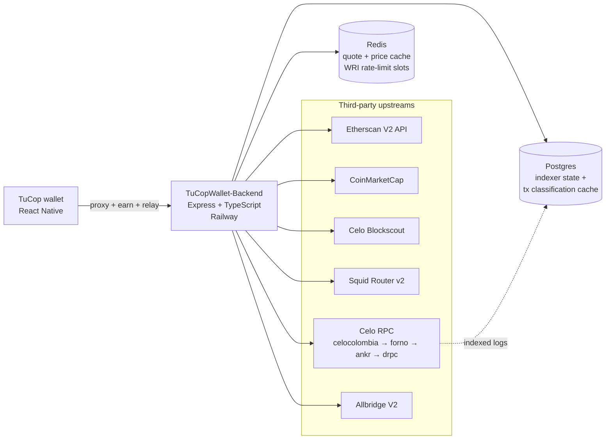

# TuCOPWallet Backend

[](https://github.com/TuCopFinance/TuCOPWallet-Backend/actions/workflows/ci.yml)
[](https://github.com/TuCopFinance/TuCOPWallet-Backend/actions/workflows/deploy-railway.yml)
[](LICENSE)
[](https://nodejs.org/)
[](https://www.typescriptlang.org/)

Backend services for [TuCopWallet](https://tucop.xyz). Proxies third-party APIs (Etherscan, CoinMarketCap, Blockscout, Squid) so API keys never ship in app bundles, runs two on-chain indexers (transactions feed + Neeru partner integration), serves the wallet's Earn surface via a `hooks-api` compatible HTTP contract, and operates a one-time EIP-7702 sponsored delegation relay so users without CELO can opt into the WRI (Wallet Relay Infrastructure) batch-execution path.

## About TuCop

TuCop is a mobile wallet for Colombian users built on the [Celo](https://celo.org) L1. The wallet is stablecoin-first (COPm, USDm, USDT, USDC) and never asks users to hold CELO for gas. This backend is the server-side counterpart that the mobile app (React Native) calls; it replaces several Valora cloud functions the wallet used to depend on, plus adds TuCop-specific pieces (Neeru Earn, WRI delegate relay, COPm/Dolares conversion paths).

- Wallet repository: [TuCopFinance/TuCopWallet](https://github.com/TuCopFinance/TuCopWallet)
- Hosted backend: `https://tucop-backend-production.up.railway.app`
- Project home: [tucop.xyz](https://tucop.xyz)

## Architecture



Two worker loops boot inside the same process:

- **Transactions indexer** (`src/transactions-indexer/`) ingests Celo blocks for opted-in addresses, classifies txs into the wallet's `TokenTransaction` shape, and persists to Postgres. Includes the EIP-7702 atomic-batch extension that Valora's feed omits.
- **Neeru indexer** (`src/neeru-indexer/`) watches four event topics on the partner contract, persists per-position state, and runs a daily reconciliation job at 03:00 UTC.

Both workers use Postgres advisory locks for multi-replica safety and back off on consecutive errors with escalating log levels for operator monitoring.

## Cross-cutting behaviour

- **Rate limit:** 300 requests per IP per 60 s window across all endpoints (`express-rate-limit`, in-memory). Sized so an active user firing ~10 swaps in 2-3 minutes (quote refreshes + receipt polling + feed/balance refresh) does not hit the wall; sustained 5 req/s is still considered bot traffic. Exceeding it returns `429 { "error": "rate limit exceeded" }`. Trust-proxy is set to one hop so Railway's LB forwards the real client IP. Per-endpoint tiering is tracked in `ROADMAP.md`.
- **Upstream timeout:** every outbound call (Etherscan, CoinMarketCap, Blockscout) is wrapped in `fetchWithTimeout` with an 8 s default, so a hung upstream never holds an inbound request open indefinitely.
- **Cache fallthrough:** when `REDIS_URL` is unset or set to the literal `disabled`, every request goes direct to upstream. Otherwise the cache is consulted with normalised keys; failed cache reads or writes fall through and never break the response.
- **Logging:** all diagnostic output goes through `src/lib/logger.ts` with per-module namespaces (e.g. `[app:req]`, `[routes:blockscout]`). In production (`NODE_ENV=production`) only `warn` and `error` are emitted.

## Documentation

Detailed documentation is under [`docs/`](./docs/):

- [**HTTP API reference**](./docs/api.md) - every endpoint (health, proxies, Squid quote, WRI relay, transactions feed, hooks-api) with request / response shapes, error codes, and rate-limit notes.
- [**Operations**](./docs/operations.md) - local development, Railway deploy chain, rollback workflow, environment variables (grouped by area), and the "adding a new whitelisted contract" runbook.
- [**Observability**](./docs/observability.md) - Prometheus metrics catalogue, Grafana dashboard notes, alert thresholds.

Design notes and historical trails:

- [`ROADMAP.md`](./ROADMAP.md) - deferred items + hardening trail per shipped PR.
- [`CONTRIBUTING.md`](./CONTRIBUTING.md) - contributor guide.
- [`SECURITY.md`](./SECURITY.md) - vulnerability reporting.
- [`LICENSES/`](./LICENSES/) - per-file attribution for vendored code (currently the Allbridge port).

## Quickstart

```bash
git clone https://github.com/TuCopFinance/TuCOPWallet-Backend.git
cd TuCOPWallet-Backend
yarn install
cp .env.example .env  # fill in the REQUIRED vars per the annotations
yarn typecheck
yarn test
yarn dev              # tsx watch mode
```

Details on env vars and the local dev loop are in [`docs/operations.md`](./docs/operations.md).

## License

Apache-2.0 (see [`LICENSE`](./LICENSE)). Third-party code under [`LICENSES/`](./LICENSES/) carries its own attribution.
