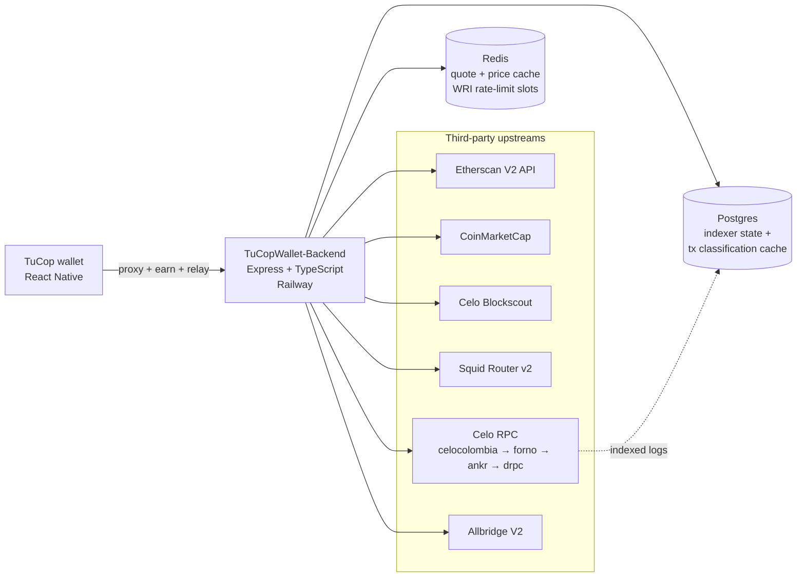

# TuCOPWallet Backend

[](https://github.com/TuCopFinance/TuCOPWallet-Backend/actions/workflows/ci.yml)
[](https://github.com/TuCopFinance/TuCOPWallet-Backend/actions/workflows/deploy-railway.yml)
[](LICENSE)
[](https://nodejs.org/)
[](https://www.typescriptlang.org/)

Backend services for [TuCopWallet](https://tucop.xyz). Proxies third-party APIs (Etherscan, CoinMarketCap, Blockscout, Squid) so API keys never ship in app bundles, runs two on-chain indexers (transactions feed + Neeru partner integration), serves the wallet's Earn surface via a `hooks-api` compatible HTTP contract, and operates a one-time EIP-7702 sponsored delegation relay so users without CELO can opt into the WRI (Wallet Relay Infrastructure) batch-execution path.

## About TuCop

TuCop is a mobile wallet for Colombian users, aligned with the [MiniPay](https://www.opera.com/products/minipay) ecosystem on the [Celo](https://celo.org) L1. The wallet is stablecoin-first (COPm, USDm, USDT, USDC) and never asks users to hold CELO for gas. This backend is the server-side counterpart that the mobile app (React Native) calls; it replaces several Valora cloud functions the wallet used to depend on, plus adds TuCop-specific pieces (Neeru Earn, WRI delegate relay, COPm/Dolares conversion paths).

- Wallet repository: [TuCopFinance/TuCopWallet](https://github.com/TuCopFinance/TuCopWallet)
- Hosted backend: `https://tucop-backend-production.up.railway.app`
- Project home: [tucop.xyz](https://tucop.xyz)

## Architecture



Two worker loops boot inside the same process:

- **Transactions indexer** (`src/transactions-indexer/`) ingests Celo blocks for opted-in addresses, classifies txs into the wallet's `TokenTransaction` shape, and persists to Postgres. Includes the EIP-7702 atomic-batch extension that Valora's feed omits.
- **Neeru indexer** (`src/neeru-indexer/`) watches four event topics on the partner contract, persists per-position state, and runs a daily reconciliation job at 03:00 UTC.

Both workers use Postgres advisory locks for multi-replica safety and back off on consecutive errors with escalating log levels for operator monitoring.

## Cross-cutting behaviour

- **Rate limit:** 300 requests per IP per 60 s window across all endpoints (`express-rate-limit`, in-memory). Sized so an active user firing ~10 swaps in 2-3 minutes (quote refreshes + receipt polling + feed/balance refresh) does not hit the wall; sustained 5 req/s is still considered bot traffic. Exceeding it returns `429 { "error": "rate limit exceeded" }`. Trust-proxy is set to one hop so Railway's LB forwards the real client IP. Per-endpoint tiering is tracked in `ROADMAP.md`.
- **Upstream timeout:** every outbound call (Etherscan, CoinMarketCap, Blockscout) is wrapped in `fetchWithTimeout` with an 8 s default, so a hung upstream never holds an inbound request open indefinitely.
- **Cache fallthrough:** when `REDIS_URL` is unset or set to the literal `disabled`, every request goes direct to upstream. Otherwise the cache is consulted with normalised keys; failed cache reads or writes fall through and never break the response.
- **Logging:** all diagnostic output goes through `src/lib/logger.ts` with per-module namespaces (e.g. `[app:req]`, `[routes:blockscout]`). In production (`NODE_ENV=production`) only `warn` and `error` are emitted.

## Endpoints

### `GET /health`

Returns service status.

```json
{ "ok": true, "service": "tucopwallet-backend", "version": "0.1.0" }
```

### `GET /api/prices/xaut`

Proxies a XAUt0 price quote (in USD) from CoinMarketCap. Cached in Redis for 60 seconds when `REDIS_URL` is configured; serves direct otherwise.

**Query params:**

| Name | Required | Description |
|------|----------|-------------|
| `vs` | no | Quote currency. Only `usd` is supported. Defaults to `usd`. |

**Success response:**

```json
{ "symbol": "XAUT", "vs": "usd", "priceUsd": 3421.5, "asOf": "2026-06-16T12:00:00.000Z" }
```

**Error responses:**

- `400` `{ "error": "only vs=usd supported" }`
- `502` `{ "error": "upstream price feed unavailable" }`

### `GET /events`

Proxies a contract event-log query to Etherscan V2 API on Celo mainnet (chainid 42220). Only whitelisted contract addresses are accepted (see `ALLOWED_CONTRACTS` in `src/app.ts`).

**Query params:**

| Name | Required | Description |
|------|----------|-------------|
| `address` | yes | Contract address (`0x` + 40 hex). Must be in `ALLOWED_CONTRACTS`. |
| `topic0` | no | Event signature topic. `0x` + 64 hex. |
| `topic1` | no | First indexed argument. `0x` + 64 hex. |
| `fromBlock` | no | Default `0`. |
| `toBlock` | no | Default `latest`. |

**Success response:**

```json
{ "events": [ { "address": "...", "topics": [...], "data": "0x...", ... } ] }
```

**Error responses:**

- `400` `{ "error": "invalid address" }` / `invalid topic0` / `invalid topic1`
- `403` `{ "error": "contract not allowed" }`
- `502` `{ "error": "etherscan error" }` / `etherscan unreachable` (upstream message is logged server-side, never returned)
- `503` `{ "error": "etherscan key not configured" }`

### Blockscout proxy

Passthrough proxy for Celo's Blockscout V2 API, injecting the API key on the server side so the mobile app never sees it. Responses are returned exactly as Blockscout returns them.

| Endpoint | Cache TTL |
|----------|-----------|
| `GET /api/v2/transactions/:hash` | 30 s |
| `GET /api/v2/addresses/:address/transactions` | 30 s |
| `GET /api/v2/addresses/:address/token-transfers` | 300 s |

Query string parameters (e.g. `filter`, `block_number`) are forwarded to upstream. The reserved `apikey` and `api_key` keys are stripped server-side so clients cannot override the server key. Cache keys are normalised (sorted, reserved params dropped, capped at 512 chars) so callers cannot blow up the Redis keyspace by passing junk params.

Validation: `:hash` must match `0x` + 64 hex; `:address` must match `0x` + 40 hex. Otherwise `400 { "error": "invalid ..." }`. Upstream failures return `502 { "error": "blockscout upstream unavailable" }`.

### `GET /api/swap/quote`

Drop-in replacement for Valora's `getSwapQuote` cloud function. Backend POSTs to Squid Router v2 with TuCop's `x-integrator-id` so swap volume attribution flows to TuCop. The response shape matches the wallet's `FetchQuoteResponse` (`src/swap/types.ts` in TuCopWallet) so the mobile-side change is a single URL flip.

**Query params (strict allowlist; any other key returns `400 { "error": "unknown param" }`):**

| Name | Required | Validation | Notes |
|------|----------|------------|-------|
| `buyToken` | yes | `0x` + 40 lowercase hex | destination token |
| `buyIsNative` | yes | `'true'` or `'false'` | substitutes the EVM native sentinel upstream |
| `buyNetworkId` | yes | matches `/^[a-z0-9-]+$/` | e.g. `celo-mainnet`, `ethereum-mainnet`, `arbitrum-one`, `op-mainnet`, `polygon-pos-mainnet`, `base-mainnet` |
| `sellToken` | yes | `0x` + 40 lowercase hex | source token |
| `sellIsNative` | yes | `'true'` or `'false'` | |
| `sellNetworkId` | yes | same set as `buyNetworkId` | |
| `sellAmount` | yes | decimal integer (smallest unit / wei) | |
| `userAddress` | yes | `0x` + 40 lowercase hex | EOA used for `fromAddress` and `toAddress` upstream |
| `slippagePercentage` | no | decimal in `[0, 100]` | defaults to `0.5` |
| `quoteOnly` | no | `'true'` or `'false'` | defaults to `'false'`. Set to `'true'` for planning quotes (multi-step `dollarsSpend` flows that fan out 3-5 parallel quotes for the same user); Squid skips the `transactionRequest` build, and per their team this path does NOT charge the wallet-based 10 RPS bucket. Refetch with `quoteOnly=false` (or omit it) on commit, once the user picks a route — that single call IS the one that counts against the bucket. |

**Success response (shape):**

```json
{
  "unvalidatedSwapTransaction": {
    "swapType": "same-chain",
    "chainId": 42220,
    "buyAmount": "998000",
    "sellAmount": "1000000",
    "buyTokenAddress": "0x...",
    "sellTokenAddress": "0x...",
    "price": "0.998",
    "guaranteedPrice": "0.993",
    "estimatedPriceImpact": "0.2",
    "gas": "300000",
    "estimatedGasUse": "200000",
    "to": "0x...",
    "value": "0",
    "data": "0x...",
    "from": "0x...",
    "allowanceTarget": "0x..."
  },
  "details": { "swapProvider": "squid" }
}
```

When `sellNetworkId !== buyNetworkId`, the `unvalidatedSwapTransaction` object additionally has `swapType: "cross-chain"` plus `estimatedDuration` (seconds), `maxCrossChainFee` and `estimatedCrossChainFee` (wei strings, sum of upstream `feeCosts`).

**Error responses:**

- `400` `{ "error": "invalid <field>" }` / `{ "error": "unknown param" }` / `{ "error": "unsupported sellNetworkId" }` / `{ "error": "unsupported buyNetworkId" }`
- `429` `{ "error": "rate limited by squid, retry" }` (pass-through when Squid throttles us; the upstream `Retry-After` header is forwarded). Squid throttles per-wallet at 10 RPS, so the safe pattern for parallel planning quotes is `quoteOnly=true` on the planner and `quoteOnly=false` only on commit.
- `502` `{ "error": "squid upstream unavailable" }` (timeout or non-429 non-2xx from Squid; the upstream message is never echoed)
- `503` `{ "error": "squid integrator id not configured" }` if `SQUID_INTEGRATOR_ID` is not set on the backend

Cached in Redis for 30 s (quotes go stale fast). Cache key includes `userAddress` so we never serve another user's prepared transaction.

### `POST /api/wri/delegate-relay`

One-time, sponsored EIP-7702 delegation setup for TuCop's Wallet Relay Infrastructure (WRI). Most TuCop users hold only stables (USDT, USDC, USDm) and no CELO; this endpoint pays the gas for the single type 0x04 transaction that delegates a user's EOA to TuCop's hardened BatchExecutor at `0xaE6a87E88b55644Eda54C3AA55B11944eE5E1DFe`. After delegation, every Dolares to Pesos conversion is a normal CIP-64 (type 0x7b) transaction paying gas in stables; CIP-64 and 0x04 are mutually exclusive at the Celo protocol level, hence this dedicated setup tx.

**Request body** (`application/json`):

```json
{
  "userAddress": "0x...",
  "signedAuthorization": {
    "chainId": "0xa4ec",
    "address": "0xaE6a87E88b55644Eda54C3AA55B11944eE5E1DFe",
    "nonce": "0x...",
    "yParity": "0x0",
    "r": "0x...",
    "s": "0x..."
  }
}
```

`signedAuthorization` is the JSON shape viem's `walletClient.signAuthorization(...)` emits.

**Security invariants (any failure -> 400, no tx submitted):**

- `userAddress` must match `0x` + 40 hex.
- `signedAuthorization.chainId` must be `42220` (Celo mainnet only).
- `signedAuthorization.address` must equal `0xaE6a87E88b55644Eda54C3AA55B11944eE5E1DFe` (case-insensitive). The relay refuses to delegate to any other contract, period. Hardcoded.
- `signedAuthorization.nonce` must equal the on-chain nonce of `userAddress` exactly. A stale or future nonce is rejected up front; the `already_delegated` short-circuit + post-mining `getCode` poll handle the propagation-lag case.
- The signature must recover to `userAddress` via `recoverAuthorizationAddress`.

**Operational invariants:**

- If the user's EOA code already starts with `0xef0100` followed by the BatchExecutor address, the endpoint short-circuits with `{ "status": "already_delegated" }` and submits no tx.
- Per-address rate limit: 1 successful relay per 5 minutes per `userAddress` (Redis-backed when `REDIS_URL` is configured, in-process Map otherwise; without Redis the limit is per-instance only).
- Relay hot-wallet health check: if balance is below `WRI_RELAY_MIN_CELO_BALANCE`, returns 503 and logs an alert.
- The global 120 req/min/IP rate limit from `app.ts` still applies on top.

**Success response (delegation submitted and confirmed):**

```json
{
  "status": "delegated",
  "txHash": "0x...",
  "userAddress": "0x...",
  "delegatedTo": "0xaE6a87E88b55644Eda54C3AA55B11944eE5E1DFe"
}
```

**Error responses:**

- `400` `{ "error": "invalid userAddress" }` / `invalid signedAuthorization` / `invalid chainId` / `invalid delegation target` / `invalid signature` / `nonce mismatch`
- `429` `{ "error": "address rate limited" }` with `Retry-After` header
- `502` `{ "error": "rpc unavailable" }` / `relay tx submission failed` / `relay tx reverted` / `relay tx unconfirmed` / `relay tx unverified`
- `503` `{ "error": "relay temporarily unavailable" }` (relay private key missing/invalid or balance below threshold)

**Out of scope:** this endpoint ONLY handles the one-time delegation setup. The actual `execute(calls)` payload that uses the delegated EOA must be sent by the wallet as a regular CIP-64 transaction; the backend does not relay batch payloads.

### Transaction feed (WRI Track C)

Backend-owned replacement for Valora's `getWalletTransactions`. Indexes Celo blocks for opted-in addresses and classifies into the same `TokenTransaction` shape the wallet already consumes, with an extension for EIP-7702 atomic batches (which Valora omits).

**Required env to enable on Railway:** `DATABASE_URL` (Postgres; migrations run on boot) and `INDEXER_ENABLED=true`. Without these the routes return `503` and the indexer loop is a no-op.

#### `POST /api/transactions/watch`

Registers an address for indexing. Called by the wallet at boot after `walletAddressInitialized`. Idempotent, safe to retry, the wallet should not block on its result.

```json
{ "address": "0x..." }
```

Response `200`: `{ "ok": true, "backfillStartedAt": null }`. The `backfillStartedAt` field will become an ISO8601 string when the backfill job (future PR) is implemented; today the indexer only catches the forward path.

Errors: `400 invalid address`, `503 database not configured`, `500 database error`.

#### `GET /api/transactions/feed`

Byte-compatible replacement for Valora. Same response envelope (`{ transactions, pageInfo: { hasNextPage, endCursor } }`) and same `TokenTransaction` discriminated union (`SENT` / `RECEIVED` / `SWAP_TRANSACTION` / `APPROVAL`).

**Query params:**

| Name | Required | Notes |
|------|----------|-------|
| `address` | yes | `0x` + 40 hex (case-insensitive) |
| `networkIds` | no | csv, defaults to `celo-mainnet` |
| `includeTypes` | no | csv of `TokenTransaction` types, filter applied post-classification |
| `localCurrencyCode` | no | reserved for future price conversion; today `localAmount` is always `null` |
| `afterCursor` | no | opaque cursor returned by a previous page |
| `pageSize` | no | 1 to 100, default 20 |

**7702 atomic-batch extension:** when one tx atomically sells more than one token, the wallet receives a single `SwapTransaction` whose `fromTokenAmounts[]` lists every sold token; `outAmount` is the highest-value leg so existing single-leg renderers keep working unchanged. `inAmount` is the bought token. The selector keyed off is `0x3f707e6b` (`execute((address,uint256,bytes)[])` on the BatchExecutor at `0xaE6a87E88b55644Eda54C3AA55B11944eE5E1DFe`).

**Token IDs:** ERC20s are emitted as `celo-mainnet:0x<contract>`. CELO native is emitted as its ERC20 contract id `celo-mainnet:0x471ece3750da237f93b8e339c536989b8978a438`, not a `:native` sentinel, so the wallet's token registry resolves it the same way as any other ERC20.

Errors: `400 invalid address` / `invalid afterCursor`, `503 database not configured`, `500 database error`.

#### Neeru indexer

Postgres-backed indexer for a partner integration on Celo. Stores per-position state used by the Earn endpoints (forthcoming PRs).

**Env to enable on Railway:**

- `NEERU_INDEXER_ENABLED=true` to start the worker. No-op without it.
- `NEERU_INDEXER_INTERVAL_MS` optional, defaults to `30000`.
- Reuses `DATABASE_URL`.

Tables created by the migration: `neeru_positions`, `neeru_indexer_state`.

RPC fallback chain (`src/neeru-indexer/rpc.ts`): tries `https://forno.celo.org` first, then `https://rpc.ankr.com/celo`, then `https://celo.drpc.org`. After repeated Forno failures the indexer skips Forno for 5 minutes before retrying.

Runs a daily reconciliation job at 03:00 UTC.

### Hooks API

Drop-in replacement for Valora's `hooks-api`. Surfaces the catalogue of Earn products the wallet renders in the Earn tab. Two apps are wired today: the Allbridge native port (LP positions + reward claims) and the Neeru Vaults partner integration (4 tranches keyed off the indexer above). The contract address and tranche metadata are read from env + on-chain at request time; no Neeru-specific constants are baked into source.

Each endpoint returns `{ "data": [...] }` with a discriminated union of `app-token` / `contract-position` entries. Tranche metadata (TVL, daily rate, lock seconds, deposit-token decimals/symbol) is fetched via one Multicall3 call and cached in-process for 30 s; per-user balances are read from `neeru_positions` (Postgres) plus a per-batch Multicall3 for `previewAccruedInterest`. Allbridge calls are wrapped in try/catch and never fail the whole response - if upstream times out the wallet still sees the Neeru side.

#### `GET /hooks-api/getPositions`

Returns positions the user already holds (Allbridge LPs with non-zero balance + Neeru tranches with non-zero principal-plus-accrued).

| Param | Required | Notes |
|------|----------|-------|
| `address` | yes | `0x` + 40 hex (case-insensitive) |
| `networkIds` | no | repeatable; defaults to `celo-mainnet` |

Returns `{ "data": Position[] }`. 400 on invalid `address` or unsupported `networkIds`.

#### `GET /hooks-api/getEarnPositions`

Returns the full catalogue (4 Neeru tranches + Allbridge LPs) regardless of holdings. When `address` is omitted, every entry has `balance: "0"`.

| Param | Required | Notes |
|------|----------|-------|
| `address` | no | `0x` + 40 hex; when set, balances are populated |
| `networkIds` | no | repeatable; restricts to listed networks |
| `supportedAppIds` | no | repeatable; restricts to listed app ids (`allbridge`, `neeru-vaults`) |
| `supportedPools` | no | repeatable; restricts to specific `positionId` values |

#### `GET /hooks-api/v2/getShortcuts`

Returns the merged shortcut catalogue (Allbridge `deposit` / `withdraw` / `claim-rewards` / `swap-deposit`, Neeru `deposit` / `withdraw` / `withdraw-principal-only`).

| Param | Required | Notes |
|------|----------|-------|
| `address` | no | reserved; ignored for now |
| `networkIds` | no | repeatable; restricts the shortcut list |

#### `GET /api/earn/neeru/positions`

Per-position detail surface for the wallet's "your positions" screen. Returns one entry per OPEN row in `neeru_positions`, enriched with live on-chain reads from the partner contract via a single batched Multicall3 request. Read responses (per-tranche metadata, deposit-token decimals, and any global view fields) are cached in-process for 30 s.

| Param | Required | Notes |
|------|----------|-------|
| `address` | yes | `0x` + 40 lowercase hex |

Any other query key returns `400 { "error": "unknown param" }` (strict allowlist).

**Response shape (placeholder values):**

```json
{
  "data": {
    "address": "0x...",
    "positions": [
      {
        "positionId": "<opaque>",
        "tranche": 1,
        "trancheLabel": "<derived from on-chain tranche metadata>",
        "principal": "<decimal-formatted>",
        "accruedInterest": "<decimal-formatted>",
        "monthlyRatePercentage": "<numeric>",
        "startTs": 1700000000,
        "endTs": 1702592000,
        "depositBlock": "<opaque>",
        "depositTxHash": "0x...",
        "renewedFromPositionId": null,
        "currentPayoutIfClosed": {
          "principal": "<decimal-formatted>",
          "interest": "<decimal-formatted>",
          "penaltyBps": "<numeric>",
          "interestAfterPenalty": "<decimal-formatted>",
          "total": "<decimal-formatted>",
          "isEarly": true
        }
      }
    ],
    "lastSyncedBlock": "<opaque>",
    "lastSyncedAt": "<iso-8601>"
  }
}
```

Notes:

- `trancheLabel` is `Flexible` for the flexible-tranche category; otherwise a `<days> dias` label derived from the on-chain tranche metadata.
- `monthlyRatePercentage` is computed from the per-position frozen-rate field stored on chain at deposit time, not from the live tranche rate, so quotes do not drift after a tranche-rate update.
- `currentPayoutIfClosed.isEarly` is `true` only when the position is locked AND `now < endTs`. The early-claim penalty math runs in wei (bigint floor division) before the value is formatted.
- `renewedFromPositionId` is always `null`; the indexer schema does not track renewal chains.
- `lastSyncedBlock` / `lastSyncedAt` come from `neeru_indexer_state` so the wallet can warn if the partner indexer is stale.

**Error responses:**

- `400` `{ "error": "invalid address" }` if `address` is missing, not lowercase, or not 40 hex.
- `400` `{ "error": "unknown param" }` for any query key other than `address`.
- `503` `{ "error": "database not configured" }` when `DATABASE_URL` is unset.
- `503` `{ "error": "neeru not configured" }` when `NEERU_DEPOSIT_TOKEN_ADDRESS` is unset.
- `502` `{ "error": "detail fetch failed" }` on any infra/RPC failure. Underlying message is logged server-side and never echoed.

#### `POST /hooks-api/triggerShortcut`

Returns the ordered list of tx calldata the wallet signs and submits to execute one shortcut. The backend performs the preflight reads (allowance, pause flag, caps, ownership) so the wallet does not have to fan out and reason about per-shortcut invariants. No tx is submitted server-side.

**Request body** (`application/json`):

```json
{
  "address": "0x...",
  "appId": "neeru-vaults",
  "networkId": "celo-mainnet",
  "shortcutId": "deposit",
  "...": "protocol-specific args"
}
```

Common fields:

| Field | Validation |
|------|------------|
| `address` | `0x` + 40 hex (case-insensitive) |
| `appId` | exact match: `allbridge` or `neeru-vaults` |
| `networkId` | exact match: `celo-mainnet` |
| `shortcutId` | string; valid set depends on `appId` |

**Per-app body shape:**

- `appId: "allbridge"`:
  - `shortcutId: "deposit"`: `{ positionAddress, tokenAddress, tokenDecimals, tokens: [{ amount }] }`
  - `shortcutId: "withdraw"`: `{ positionAddress, tokenDecimals, tokens: [{ amount }] }`
  - `shortcutId: "claim-rewards"`: `{ positionAddress }`
- `appId: "neeru-vaults"`:
  - `shortcutId: "deposit"`: `{ trancheId, tokens: [{ tokenId, amount }] }`. `trancheId` is `0..3`, `amount` is a decimal integer in whole units (the backend reads the deposit-token decimals from chain and scales to wei).
  - `shortcutId: "withdraw"`: `{ positionId }`. `positionId` is a decimal integer string.
  - `shortcutId: "withdraw-principal-only"`: `{ positionId }`.

**Success response:**

```json
{
  "data": {
    "transactions": [
      { "to": "0x...", "data": "0x...", "value": "0", "networkId": "celo-mainnet" }
    ],
    "dataProps": {}
  }
}
```

Each transaction is JSON-safe: `value` is a string (`"0"` for non-payable calls), `data` is the encoded calldata, `to` is lowercase 40-hex. `dataProps` is reserved for upstream shapes that need to surface extra info (e.g. a future Squid-backed swap-deposit) and is currently always `{}`.

**Error responses:**

- `400` `{ "error": "invalid <field>" }` for body validation failures (`invalid address`, `invalid tokens`, `invalid positionId`, etc.) and `unknown appId` / `unknown shortcut` / `unsupported networkId`.
- `400` `{ "error": "<code>" }` when the preflight catches a recoverable wallet-side issue. The set of codes is the contract's own validation surface; the wallet handles each code as a user-facing message. Codes are stable but intentionally not enumerated in this public doc to keep the partner contract's behavior model private. The full list is in `src/hooks-api/routes.ts` (`TRIGGER_USER_ERROR_CODES`).
- `502` `{ "error": "shortcut build failed" }` for any other (infra / RPC) failure. The underlying message is logged server-side and never echoed.
- `503` `{ "error": "neeru not configured" }` when the Neeru env vars are not set.
- `503` `{ "error": "database not configured" }` when a Neeru withdraw is requested without `DATABASE_URL`.

#### Env vars

- `NEERU_DEPOSIT_TOKEN_ADDRESS` (required for the Neeru catalogue; `0x` + 40 hex). The Neeru side of every endpoint is a no-op when unset: requests still succeed but return only the Allbridge slice.
- `NEERU_TRANCHE_IMAGE_URL_TEMPLATE` (optional). Template with `{N}` placeholder, e.g. `https://cdn.tucop.xyz/neeru/tranche-{N}.png`. Empty string when unset.
- `NEERU_MANAGE_URL` (optional). Surfaced in `displayProps.manageUrl` and `dataProps.manageUrl`. Empty string when unset.
- `NEERU_TERMS_URL` (optional). Surfaced in `dataProps.termsUrl`. Empty string when unset.
- `NEERU_CONTRACT_CREATED_AT_ISO` (optional). ISO 8601 string. Surfaced in `dataProps.contractCreatedAt`. `null` when unset.

#### Provisioning the relay hot wallet (one-time, before enabling on Railway)

1. Generate a throwaway key. Example with foundry:

   ```bash
   cast wallet new
   # Address: 0x...
   # Private key: 0x...
   ```

2. Fund the address with around 10 CELO (this covers thousands of delegation setups). Top up when balance approaches `WRI_RELAY_MIN_CELO_BALANCE`.
3. On Railway, set `WRI_RELAY_PK` to the private key (with the `0x` prefix). The backend logs the derived address at startup so you can confirm the right key was loaded.

## Local development

```bash
cp .env.example .env
# Fill in ETHERSCAN_API_KEY from https://etherscan.io/myapikey
yarn install
yarn dev
```

Smoke test:

```bash
curl 'http://localhost:8080/health'
curl 'http://localhost:8080/events?address=0x947c6db1569edc9fd37b017b791ca0f008ab4946&fromBlock=0&toBlock=latest'
```

## Deploy

Hosted on Railway in the TuCop Wallet project, environment `production`. Auto-deploys on every push to `main` via the `.github/workflows/deploy-railway.yml` GitHub Action, which fires after the `CI` workflow succeeds and calls Railway's `serviceInstanceDeployV2` GraphQL mutation with the head SHA. Requires `RAILWAY_API_TOKEN`, `RAILWAY_SERVICE_ID`, `RAILWAY_ENVIRONMENT_ID` in the repo's GitHub Actions secrets. The Railway-managed GitHub integration is no longer relied on for deploy triggering.

Required Railway env vars:

- `ETHERSCAN_API_KEY` -- Etherscan V2 unified API key (works across all supported chains)
- `COINMARKETCAP_API_KEY` -- CoinMarketCap Pro API key, needed by `/api/prices/xaut`
- `BLOCKSCOUT_API_KEY` -- optional; injected as `apikey` query param when proxying Blockscout
- `BLOCKSCOUT_BASE_URL` -- optional; defaults to `https://celo.blockscout.com`
- `SQUID_INTEGRATOR_ID` -- required for `/api/swap/quote`. Sent to Squid as the `x-integrator-id` header so revenue attribution lands on TuCop. Local value lives in Keychain (`acct=tucop-finance`, `svce=SQUID_INTEGRATOR_ID`).
- `REDIS_URL` -- optional; when set, enables caching for price quotes and Blockscout responses. Set to the literal string `disabled` to keep the var present but skip Redis entirely. On Railway use `${{Redis.REDIS_PUBLIC_URL}}` (public proxy) or `${{Redis.REDIS_URL}}` (private internal); the client only forces IPv6 lookup for hostnames containing `.railway.internal`, so public proxy URLs keep working.
- `WRI_RELAY_PK` -- required for `/api/wri/delegate-relay`. 32-byte hex private key (with `0x` prefix) of the relay hot wallet that pays gas for one-time EIP-7702 delegation setup. Provision via `cast wallet new` and fund with about 10 CELO. The backend logs the derived address at startup so the correct key is easy to confirm.
- `WRI_RELAY_MIN_CELO_BALANCE` -- optional; minimum relay balance in wei. Default `500000000000000000` (0.5 CELO). Below this the endpoint returns 503.
- `WRI_RELAY_MAX_GAS` -- optional; gas cap (uint256) the relay will commit on a single delegation tx. Default `1000000`.
- `PORT` -- injected automatically by Railway

## Adding a new whitelisted contract

Edit `ALLOWED_CONTRACTS` in `src/routes/events.ts`. Use lowercase. Open a PR, merge to `main`, Railway redeploys.
